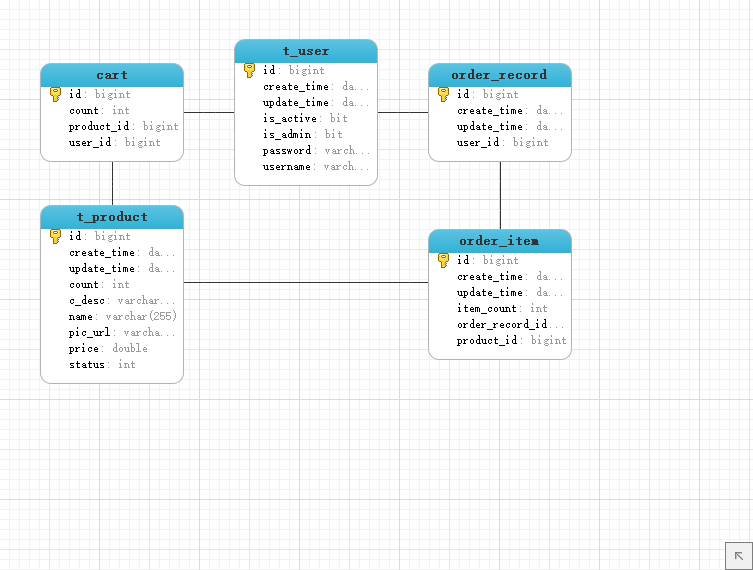

# 基于SpringBoot的二手市场

## 技术点

1. Controller -> Service -> Dao -> Entity(Domain) 分层设计
2. Spring拦截器（Interceptor）
3. 跨域配置：
    - CrossOrigin注解完成
    - 在Interceptor拦截器的postHandle方法中对response加上header
    - 使用自定义filter，在doFilter方法中处理
4. JWT 做token验证（登录验证）
5. 自定义注解完成Token认证拦截 -- 配合拦截器完成
6. 使用ResultData来统一封装返回的数据
7. 使用ControllerAdvice注解处理全局异常


## 问题

如何使用JPA做联合主键，比如购物车表中的用户id和产品id

## 数据库ER图




## 技术问题总结

使用 `@RequestBody` 注解可以接收 `application/json` 类型的参数。

处理文件上传大小的异常：
> Resolved [org.springframework.web.multipart.MaxUploadSizeExceededException

解决方案：配置文件加上以下配置
```yml
spring.servlet.multipart.max-request-size=1000MB
spring.servlet.multipart.max-file-size=1000MB
```

### 跨域的拦截器或者Filter配置

```java
response.setHeader("Access-Control-Allow-Origin", "*");
response.setHeader("Access-Control-Allow-Methods", "*");
response.setHeader("Access-Control-Allow-Headers", "*");
response.setHeader("Access-Control-Allow-Credentials","true");
response.setHeader("Access-Control-Max-Age", "3600");
```

### 在Spring中显示SQL语句

在 `application.properties` 文件中添加： `spring.jpa.show-sql=true`即可。

### 使用Spring Jpa为数据库字段添加默认值的几种方式

1. 使用 `@Column` 注解， 例如：`@Column(nullable = false,columnDefinition = "int default 1")` 表明当待存入数据库中的实体字段的值为null的时候将该字段的值置为1。但是这个注解只有在建表时才会起作用，也就是说，如果DB中表已经建好，该属性没有必要使用。
    - 如果使用该方法，并且在 `@Column` 注解的参数中设置了nullable为false，则还需要在Entity所在的实体类上添加 `@DynamicInsert` 和 `@DynamicUpdate` 注解或者设置 `@Column` 注解的参数 `insertable=false` 才可以。否则会报 `could not execute statement; SQL [n/a]; constraint [null]; nested exception is org.hibernate.exception.ConstraintViolationException: could not execute statement` 错误。
    - 设置该参数的原理就是在Spring生成SQL语句的时候忽略这个字段。
    - 使用这种方式会存在一个问题，通过repo的save方法保存的实例对象是不会带有默认值的。
2. 重写Entity的 `save()` 方法，在程序中手动添加使用默认值的逻辑。  ->  可控性强，推荐使用！

### SpringBoot 中插入数据自动生成日期字段

参考：<https://blog.csdn.net/wsy85/article/details/79969885>

1. 在Entity类中加入@EntityListeners注解`@EntityListeners(AuditingEntityListener.class)`,在需要自动生成日期的字段上加上@CreatedDate
2. 在Application类加上@EnableJpaAuditing注解`@EnableJpaAuditing`
3. 写Repository接口，在保存的时候会自动进行处理